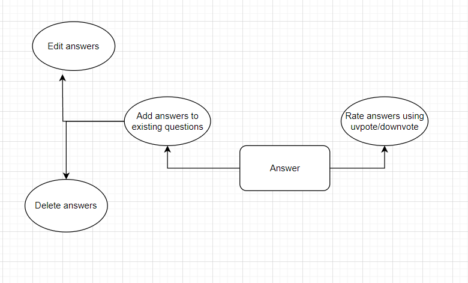

# dev_dive_backend

## Dev Dive 
#### This is a Q&A platform with a built-in gpt-like bot, which provides all the means to search for interesting data and communicate with other people

## Used technologies:
- Python 3.11
- FastAPI + Uvicorn
- PostgreSQL
- Asyncpg + SQLAlchemy 2.x
- Alembic
- Redis
- Docker Compose
- Black + Isort + Mypy

## Database ERD


## Use-Case Diagrams: 
 ### User Scenario
   
 ### Moderator Scenario
   
 ### Admin Scenario
   
 ### Question Scenario
   
 ### Answer Scenario
   

## Set up with Docker Compose:
1) Go to terminal
2) Clone repo
```
git clone https://github.com/Neurotrier/dev_dive_backend.git
```
3) Open dev_dive_backend folder
4) Create `.env` file based on `.env.example`
5) Start docker compose containers in terminal from current folder
```
docker compose up --build
```
6) Start uvicorn
```
uvicorn main:app --host 0.0.0.0 --port 8000
```
7) Go to `0.0.0.0:8000/docs` in your browser - SwaggerAPI
### You need to create a new account if you dont have any or use existing one to sign in.
### Only then you will be able to successfully send requests via SwaggerUI

## Remote connection
### We use Ngrok! All you need to to is to login in https://ngrok.com/ using your github account or email, then follow this article https://habr.com/en/articles/674070/. You just need to open tcp ports and start your application! 

## Enjoy!


